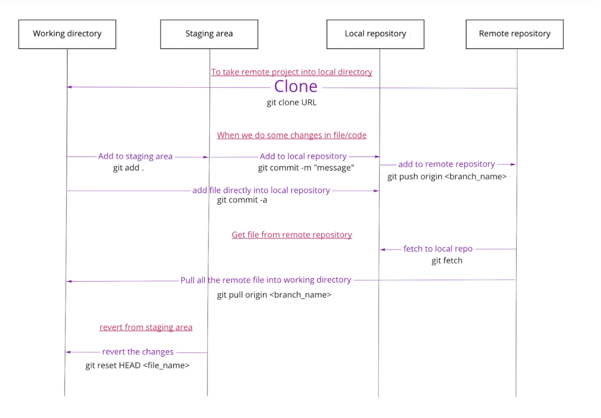

# GIT

Global information tracker abbreviated as git is an open-source distributed version control system used to keep track of changes committed to files during the entire development life cycle.

Version control - To track and manage the changes made in a code.

Distributed Version Control - Version Control can be either Centralized or Distributed. In distributed, the code is present in central server as well as in all the developer's computer.

## Staging area working

## Commands

| Commands                                | Description                                              |
| --------------------------------------- | -------------------------------------------------------- |
| git init .                              | Initialize git into the current repository               |
| git status                              | Gives status of the staging area                         |
| git add <file/s>                        | Adds file/s to the staging area                          |
| git restore --staged                    | Removes file/s from the staging area                     |
| git commit <file/s> -m<message>         | Adds staged file/s to the local repository               |
| git remote add origin <URL>             | Adds the origin to the local repository                  |
| git push origin <branch\_name>          | Pushes specific branches modification to remote          |
| git branch                              | Lists all branches in the current repo                   |
| git branch <branch\_name>               | Creates a branch of a specified name                     |
| git checkout <branch\_name>             | Switches to the specified branch                         |
| git checkout -b <branch\_name>          | Creates branch and switch to it                          |
|git switch <branch\_name> | Swicth to different branch |
| git merge <branch\_name>                | Merge specific branch to current branch                 |
| git clone <repo-url>                    | Copies remote repo to the local machine                  |
| git pull <branch\_name>                 | Pulls contents of remote branch to local                 |
| git log                                 | Lists previous commit history                            |
| git diff                                | Shows modifications before commit                        |
| git show <commit-id>                    | Show modifications after commit                          |
| git push origin --delete <branch\_name> | Deletes remote branch                                    |
| git branch -D  <branch\_name>           | Deletes local branch                                     |
| git branch -m <old-name> <new-name>     | Renames local branch                                     |
| git checkout --<target>                 | Reverts changes to the staged version                    |
| git reset \[commit-id\] --mix           | Brings committed changes to the working directory        |
| git reset \[commit-id\] --soft          | Brings committed changes to the staging area             |
| git reset \[commit-id\] --hard          | Deletes committed changes                                |
|git reset HEAD <file_name> | Remove file from the staging area |
| git stash                               | Stashes uncommitted changes if the file is being tracked |
|git stash pop | Pop the file from the stash |
|git stash list | List all the files in the stash |
|git remote -v | List the remote origin |
|git remote set-url origin <new_remote-url>| Change the remote origin |
|git tag <tag_name> | to add tag|
|git tag | to see all the tag|
|git push origin --tags | to push tag to remote|

## Errors

1. **Conflict**

  Conflict error occurs when 2 developers update the same line of a file simultaneously.

2. **Push error**

This error occurs when someone tries to push to the remote repo and the branch on which we are pushing is previously updated/committed by another developer.

This means that the head in the local repo lags behind the head of the remote machine (in other words our local branch is not up to date with the remote branch)

3. **Access Error**

This error occurs when someone does not have permission to push changes in the branch.

## Do's and Don'ts

Do’s :

* Before modifying our code, do git pull the latest code/commit on the main branch.
* If a branch is not committed (and we can’t commit it right now) and have to switch to master,at that time we can do git stash(it backs up this code) and by git stash pop we can again resume our work where we left it.
* Always save files and then add files to staging area.
* Commit message should be in present tense and it should tell what the commit does.
* Always use git status and git diff.
* We use git stash when we have made some changes in a file present in our local repository and have to switch to another branch or pull any updates without committing the current changes.

Don'ts :

* Avoid using '**git add .**', Instead specify the file names you want to add in staging area.
* Avoid doing git reset if pushed to remote, instead modify and add comments.
* Do not add node_module file in the remote.

